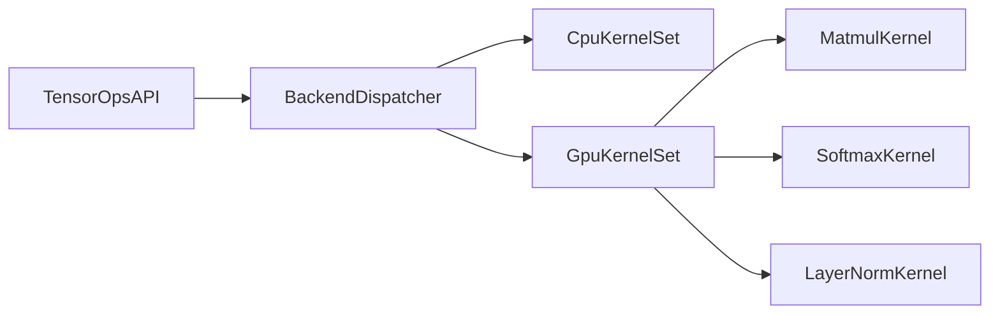

# GPU Backend PoC Plan

This document defines a practical PoC path for a GPU backend in RSI-ML.

## Scope

First GPU targets:

1. `matmul`
2. `softmax`
3. `layer_norm`

These cover the hot path for transformer-style models.

## Design Goals

- Keep current CPU API stable.
- Add GPU backend behind feature flags.
- Support fallback to CPU without code changes for callers.

## Proposed Architecture

## Backend Selection

- Compile-time flag: `gpu_stub`
- Runtime env:
  - `RSI_ML_BACKEND=cpu|gpu`

When `gpu` is unavailable or initialization fails, fallback to CPU.

## Execution Plan

### Phase A: GPU stub wiring

- Add backend enum and dispatcher interface in core.
- Keep all kernels CPU; use the same call path.

### Phase B: Matmul PoC

- Implement GPU matmul kernel first.
- Validate numerical parity with CPU on fixed seeds.

### Phase C: Softmax and LayerNorm

- Add row-wise softmax kernel.
- Add layernorm kernel (mean/var normalization path).

### Phase D: Training integration

- Ensure backward path uses same backend dispatch model.
- Add mixed path checks (CPU forward/GPU backward not allowed by default).

## Validation

- Correctness:
  - CPU vs GPU max absolute error checks.
- Performance:
  - Compare against CPU tiled/rayon baseline for 128~1024 matrix sizes.
- Stability:
  - Long-run benchmark (1000+ iterations) without memory growth.

## Risks

- Data transfer overhead can dominate small tensors.
- Different numerical behavior (floating-point reduction order).
- Backend complexity can outgrow current simple autograd graph model.

## Exit Criteria for PoC

- `matmul` GPU path faster than CPU baseline for 512+ square matrices.
- `softmax` and `layer_norm` kernels functionally correct.
- CI can run CPU-only tests; GPU tests run in optional workflow.
